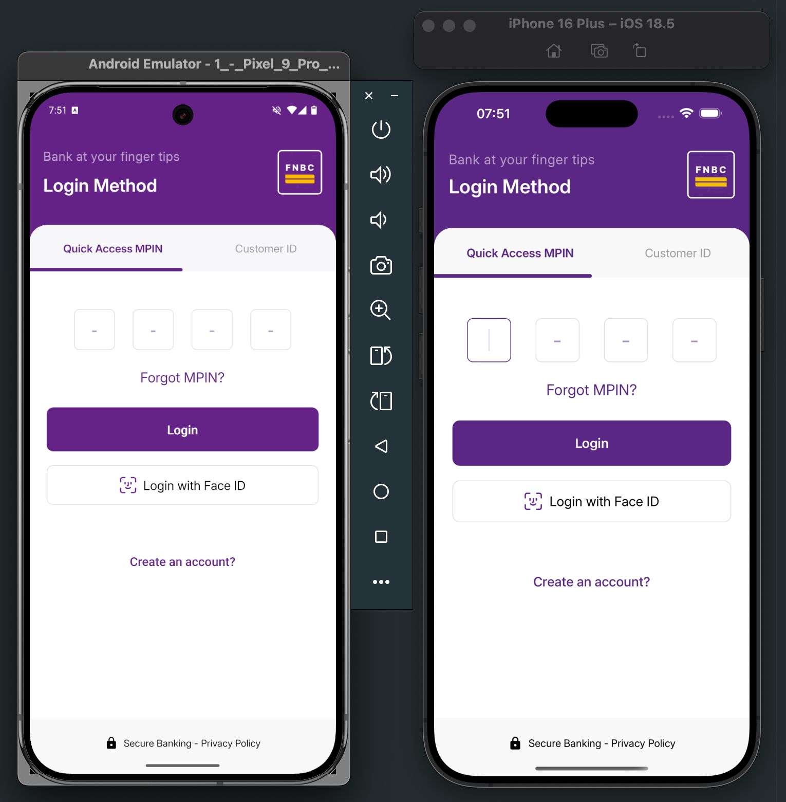
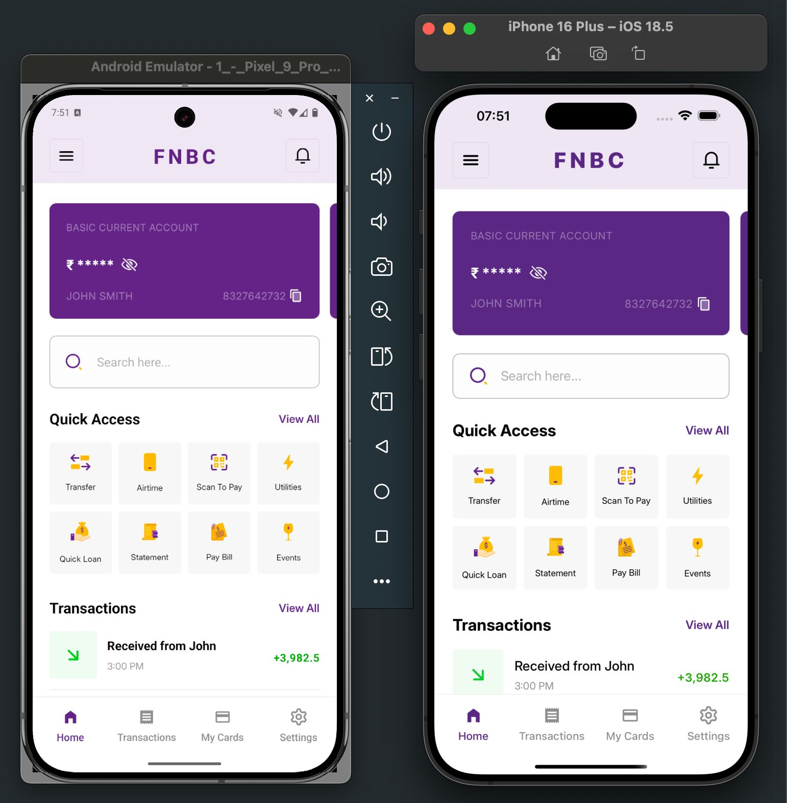
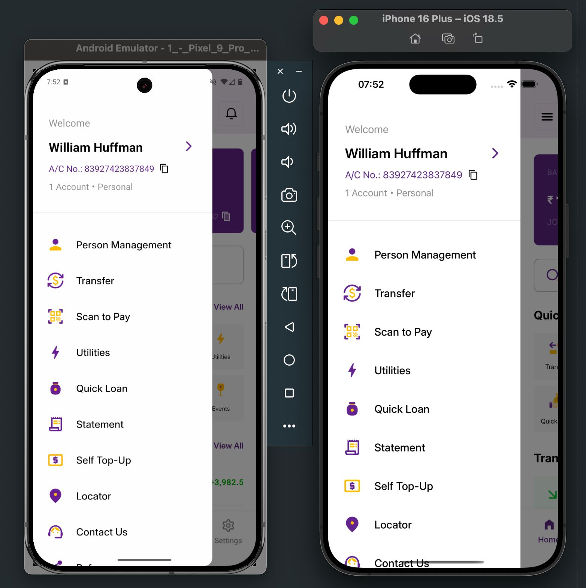
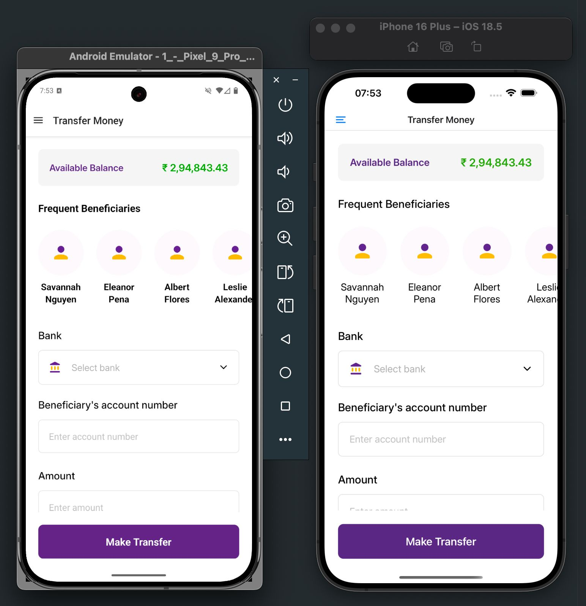

# FNBC App Design 👋

This is a React Native project designed based on the [Banking & Finance UI](https://www.figma.com/community/file/1294726945146732313) on Figma

## Get started

1. Install dependencies

   ```Shell
   npm install
   ```

2. Start the app

   ```Shell
   npx expo start
   ```

In the output, you'll find options to open the app in a

* [development build](https://docs.expo.dev/develop/development-builds/introduction/)
* [Android emulator](https://docs.expo.dev/workflow/android-studio-emulator/)
* [iOS simulator](https://docs.expo.dev/workflow/ios-simulator/)
* [Expo Go](https://expo.dev/go), a limited sandbox for trying out app development with Expo

## Screenshots

### [Login Screen](https://www.figma.com/design/JkiHOcs0jkLp2FtxDMYYlv/Banking--Finance---E-Pay----App-UI--Community-?node-id=2-7740&t=9BHOjfdUlCz6FaU6-0)



### [Home Screen](https://www.figma.com/design/JkiHOcs0jkLp2FtxDMYYlv/Banking--Finance---E-Pay----App-UI--Community-?node-id=2-7105&t=9BHOjfdUlCz6FaU6-0)



### [Side Menu Screen](https://www.figma.com/design/JkiHOcs0jkLp2FtxDMYYlv/Banking--Finance---E-Pay----App-UI--Community-?node-id=2-7339&t=9BHOjfdUlCz6FaU6-0)



### [Transfer Screen](https://www.figma.com/design/JkiHOcs0jkLp2FtxDMYYlv/Banking--Finance---E-Pay----App-UI--Community-?node-id=2-7669&t=9BHOjfdUlCz6FaU6-0)


